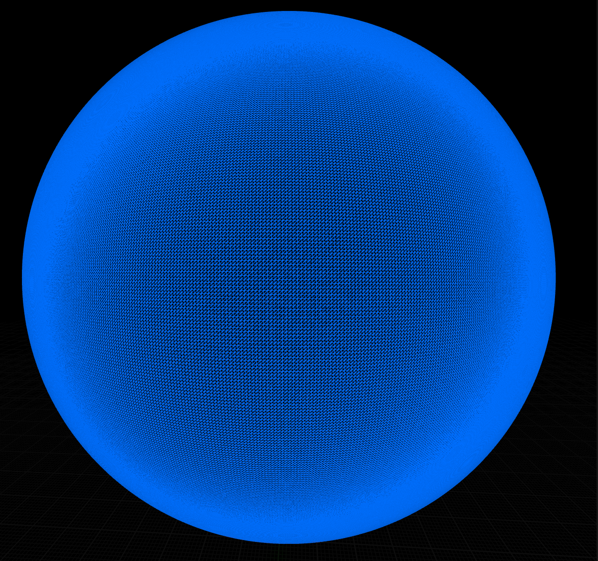

# Procedural Terrain Generation in Unreal Engine 5

**IN PROGRESS**

This project utilizes the code plugin *Realtime Mesh Component* by TriAxis-Games: 
* [RMC Plugin Source](https://github.com/TriAxis-Games/RealtimeMeshComponent "RMC Plugin Source")

## Overview
- [x] Phase One: Generate a Cube-Sphere. In our use case, this is a tessellated cube where all vertices are normalized to be the same distance from the origin, thus creating a sphere.
      
      
- [ ] Phase Two: Implement terrain noise (ie: Perlin, Simplex, etc.) at base LOD.
- [ ] Phase Three: Leverage Quadtree data structure to successfully implement Level of Detail system which increases LOD as camera moves closer towards mesh.
  
